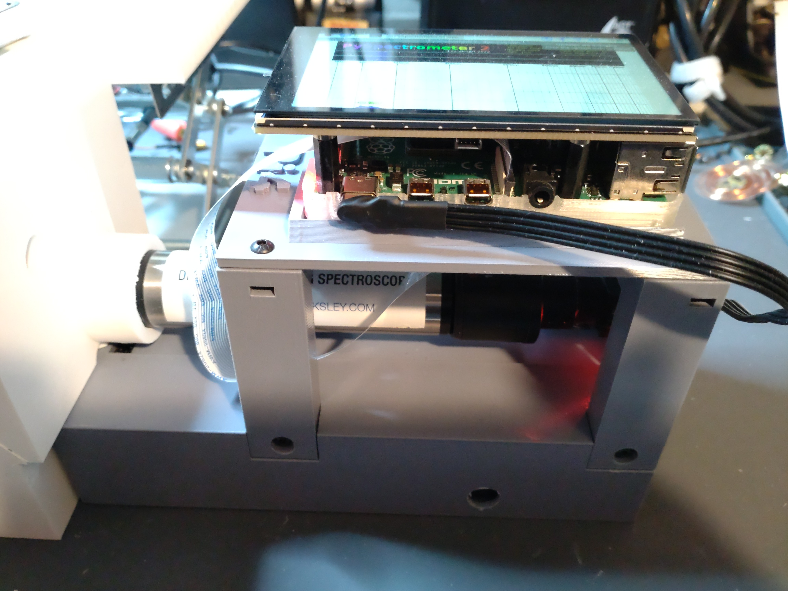
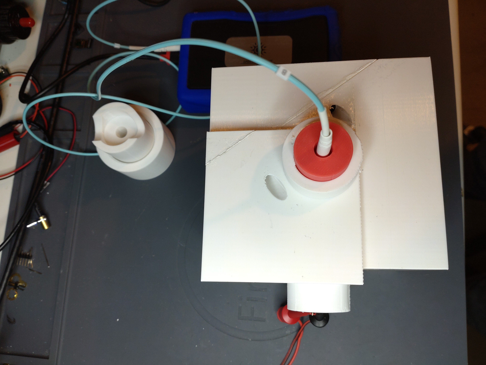

# Spectrometer-fixture-and-Ulbricht-Sphere
3D printable parts for Spectrometer and an Ulbricht Sphere, created in Rhino 8

Recently i came across Les Wrigth's interesting PySpectrometer repo's (https://github.com/leswright1977/PySpectrometer2).
He made a very stable holder for the Spectrometer and a Pi-Camera and connected it to a Rasperry Pi and a Display. Very impressive project. 
I decided to build my own device because i wanted to test some UV/IR LEDs and UV/IR Lasers. 
In addition to his repo here on github, he has some very interesting videos about Laser stuff, the Spectrometer project and an Ulbricht Sphere.
The Ulbricht Sphere is a nice addon for experimenting with the PySpectrometer.

I also bought a Spectryx Blue Box which is also a spectrometer with a fiber optic sensor.

For my experiments i designed the parts and 3D printed it.

## 1. Enclosure/fixture for Spectroscope, RPiv2 Camera, 20.000 mAh Powerbank, RPi4, RPi-Display. I followed Les Wrights setup.

The Enclosure consists of 6 parts that are screwed together using M3 Buttonhead Allen socket screws and M3 square nuts.
The Rpi4 and the Display are screwd together and mounted on a slider that fits on top of the fixture. 
The Spectroscope is also mounted on a slider using M3 Buttonhead Allen socket screw and M3 square nut. I used hook'n loop tape to hold it in place.
I also used hook'n loop tape for the Powerbank to prevent it from sliding out of the enclosure.

 
 

 

## 2. Ulbricht Sphere
I made 2 versions of the Ulbricht Sphere. Both consist of 2 parts that are screwd togehter using M3 Buttonhead Allen socket screws and M3 square nuts.
Both are designed to be fit to the PySpectroscope enclosure/fixture. The light source can be applied from the top or from the side by rotating the Sphere by 90 degree.
The main different is, the first one is clearly recognizable as a sphere. The disadvantage is that the cut surface of both halves is exactly where the laser beam hits the surface of the sphere.

The second version looks like a cube from the outside. I rotated the cutting surface by 45° so that the laser beam hits an undisturbed surface.
As described by Les Wright in his video, the surface of the Ulbricht Sphere has to be painted with Bariumsulfat / BaSO4. 
BaSO4 looks like powder. To apply it to the surface, you have to liquefy it and bind it so that it adheres to the surface.
I tried the mixture reccomended by Les Wright but it dried poorly, cracked after drying, and did not adhere to the surface properly. It crumbled. 

I prepared the second Sphere before painting with adhesive primer. I then used a mixture from "Kremer Pigmente, Germany". It's also BaSO4, they called it Blanc Fix. Instead of PVA glue they use something called Klucel(TM) G (Hydroxypropylcellulose) and also demineralised water. This mixture adhered much better to the surface. After some trials i used a paintbrush to apply the mixture to the surface and the cut surface.

 
 

   
## 3. Holder for fiber optic sensor of the Spectryx Blue Box to fit in the Ulbricht Sphere

I designed an adapter for the fiber optic cable to fit it's end to the Ulbricht Sphere exit point. I also designed adapters to center the laser to the entry point of the Sphere.
I use 3 axis holders from Aliexpress to keep the laser modules in position. If you use Octave with the Spectryx Blue Box make sure to edit the file to point to the correct device.

 
 

 
 
 

 
 

 
 
 

 
 

 
 

